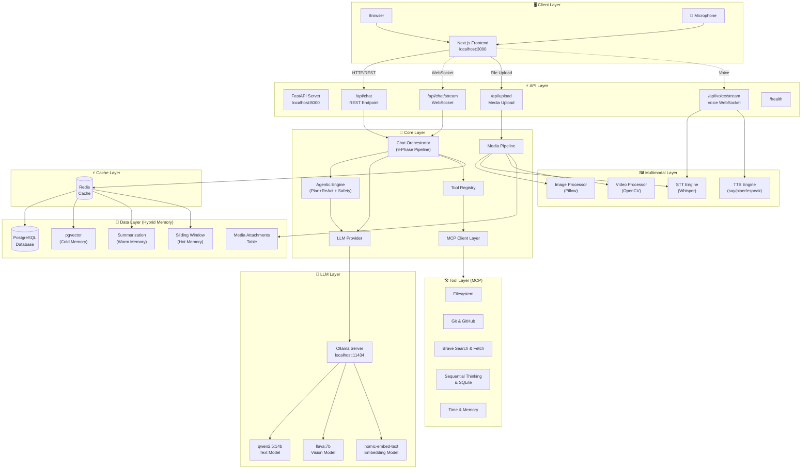
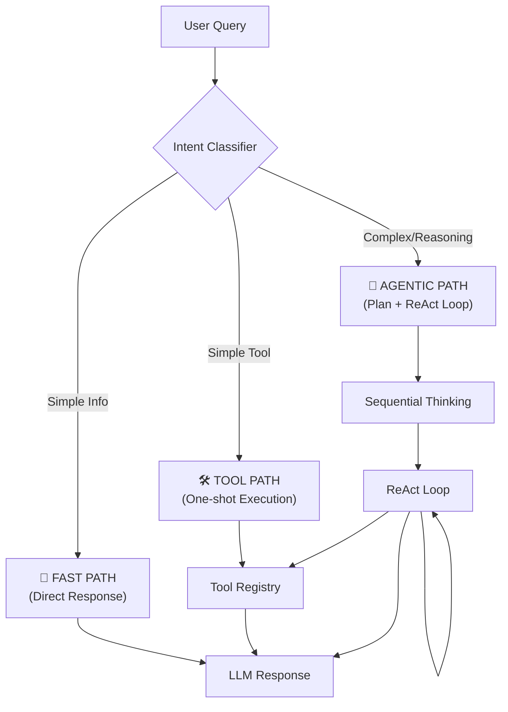

<div align="center">

# 🤖 ProdBot

### From Zero to Production AI Chatbot

[](LICENSE)
[](https://www.python.org/)
[](https://nodejs.org/)
[](docker-compose.yml)
[](https://fastapi.tiangolo.com/)
[](https://ollama.ai/)

**A self-hosted, production-grade AI chatbot platform that runs entirely on your machine.**
**No API keys required. No cloud dependency. Full control.**

*Multimodal input · Real-time voice · WebSocket streaming · Agentic reasoning · MCP tools · Observability*

[Quick Start](#-quick-start) · [Features](#-features) · [Architecture](#%EF%B8%8F-architecture) · [Documentation](#-learn--build-phase-by-phase) · [Tech Stack](#%EF%B8%8F-tech-stack)

</div>

---

## Why ProdBot?

Most chatbot tutorials stop at "hello world." ProdBot is a **complete, battle-tested system** — from LLM inference to database persistence, from tool orchestration to production observability.

- 🏢 **Enterprise-ready** — Multi-tenant architecture, Redis caching, PostgreSQL persistence, Prometheus + Grafana monitoring
- 🎓 **Beginner-friendly** — 10+ phases of detailed documentation guide you from core concepts to production deployment
- 🔒 **Fully self-hosted** — Runs on Ollama with open-source models. Your data never leaves your infrastructure
- ⚡ **Production-hardened** — Red-team tested, behavioral benchmarks, deep audit with 12 critical fixes applied

> [!TIP]
> **New to building chatbots?** Follow the [phase-by-phase documentation](#-learn--build-phase-by-phase) — each phase builds on the previous one, taking you from a simple chat loop to a fully orchestrated, multimodal AI system.

---

## ✨ Features

- 🧠 **9-Phase Chat Orchestrator** — Intent classification, context injection, hybrid memory, tool routing, agentic reasoning, and response synthesis — all in a single pipeline
- 🤖 **Agentic Engine** — Plan + ReAct loop with cycle detection, circuit breaker, tool retry, and safety guardrails for complex multi-step tasks
- ⚡ **Adaptive Routing** — Trivial bypass (<1ms), fast path (~5s), tool path (~20s), and full agentic path (60s+) based on query complexity
- 🖼️ **Multimodal Input** — Upload images, audio, and video. Auto-switches to vision model (LLaVA) for image understanding. Keyframe extraction for video
- 🎤 **Real-Time Voice** — Full-duplex WebSocket voice conversation with Whisper STT and multi-backend TTS (piper/macOS say/espeak)
- 🔌 **MCP Tool Ecosystem** — 15+ Model Context Protocol servers: filesystem, Git, GitHub, Brave Search, Docker, Slack, Google Maps, sequential thinking, and more
- 🧲 **Hybrid Memory System** — Hot (sliding window), warm (summarization), and cold (pgvector semantic search) memory tiers for intelligent context management
- 🌐 **Multi-Provider LLM** — Ollama (default), OpenAI, Anthropic, and Gemini support with runtime model switching from the UI
- 📡 **WebSocket Streaming** — Token-by-token response streaming with real-time status indicators (thinking, tool execution, synthesis)
- 📊 **Full Observability** — Prometheus metrics, Grafana dashboards, node exporter, health checks — production monitoring out of the box
- 🔐 **Multi-Tenant Ready** — User isolation, conversation threading, session management, role-based access architecture
- 🧪 **Extensively Tested** — Red-team security suite, behavioral benchmarks, trajectory evaluation, integration tests, and live pipeline audits

---

## 🚀 Quick Start

### Prerequisites

| Tool | Purpose |
|------|---------|
| **Python 3.11+** & Poetry | Backend runtime |
| **Node.js 20+** & npm | Frontend runtime |
| **Docker & Docker Compose** | PostgreSQL, Redis, monitoring |
| **Ollama** | Local LLM inference — [Install →](https://ollama.ai/) |
| **FFmpeg** | Audio/video processing — `brew install ffmpeg` |

### 1️⃣ Clone & Configure

```bash
git clone https://github.com/your-username/chatbot-ai-systems-production.git
cd chatbot-ai-systems-production

cp .env.example .env
cp frontend/.env.example frontend/.env.local
```

> [!IMPORTANT]
> To enable MCP tools (web search, GitHub, Slack, etc.), add your API keys to `.env`.
> See [docs/MCP_SETUP.md](docs/MCP_SETUP.md) for the full guide.

### 2️⃣ Pull Models

```bash
ollama serve                        # Start Ollama
ollama pull qwen2.5:14b-instruct   # Text model
ollama pull llava:7b                # Vision model
ollama pull nomic-embed-text        # Embedding model
```

### 3️⃣ Start Backend

```bash
docker-compose up -d postgres redis          # Start databases
poetry install                                # Install dependencies
poetry run alembic upgrade head               # Run migrations
poetry run uvicorn chatbot_ai_system.server.main:app --reload --host 0.0.0.0 --port 8000
```

### 4️⃣ Start Frontend

```bash
cd frontend
npm install
npm run dev
```

### 🎉 You're Live!

| Service | URL |
|---------|-----|
| **Chat UI** | http://localhost:3000 |
| **API Docs** | http://localhost:8000/docs |
| **Health Check** | http://localhost:8000/health |
| **Grafana** | http://localhost:3001 (admin/admin) |
| **Prometheus** | http://localhost:9090 |

---

## 🏗️ Architecture



---

## ⚡ How It Works — Adaptive Execution

ProdBot automatically classifies every query and routes it through the optimal execution path:



| Path | When | Latency |
| :--- | :--- | :--- |
| **Trivial Bypass** | Greetings, acknowledgments ("hi", "thanks") — skips LLM entirely | **<1ms** |
| **Fast Path** | Facts, definitions — direct LLM response, tools disabled | **~5-8s** |
| **Tool Path** | Single-step tasks ("list files", "search web") — one-shot tool call | **~20-40s** |
| **Agentic Path** | Complex reasoning — full Plan+ReAct loop with safety guardrails | **60s+** |

---

## 🔌 MCP Tool Ecosystem

ProdBot dynamically loads [Model Context Protocol](https://modelcontextprotocol.io/) servers based on your `.env` configuration:

| Category | Tools | Env Key Required |
|----------|-------|------------------|
| **Core** | Filesystem, Time, Memory (Knowledge Graph), PostgreSQL | None (built-in) |
| **Research** | Brave Search, Puppeteer, Fetch (HTTP) | `BRAVE_API_KEY` |
| **Developer** | Git, GitHub, Docker, E2B Code Interpreter | `GITHUB_TOKEN`, `E2B_API_KEY` |
| **Brain** | Sequential Thinking, SQLite | None (built-in) |
| **Connectors** | Slack, Google Maps, Sentry | `SLACK_BOT_TOKEN`, `GOOGLE_MAPS_API_KEY`, `SENTRY_AUTH_TOKEN` |

<details>
<summary><strong>⚙️ How to Enable / Update MCP Tools</strong></summary>

1. Open your `.env` file and add the API key for the tool you want to enable:
   ```bash
   # Example: Enable web search
   BRAVE_API_KEY=your-brave-api-key

   # Example: Enable GitHub integration
   GITHUB_TOKEN=ghp_your-github-token
   ```
2. Restart the backend — ProdBot auto-discovers available servers on startup
3. The tool is now available to the chatbot's orchestrator and will be used when relevant

> Tools without required API keys (Filesystem, Time, Git, Sequential Thinking, SQLite) work **out of the box** with zero configuration.

See [docs/MCP_SETUP.md](docs/MCP_SETUP.md) for the complete setup guide with all available servers.

</details>

---

## 🛠️ Tech Stack

| Layer | Technologies |
|-------|-------------|
| **Backend** | FastAPI · SQLAlchemy (async) · Pydantic · WebSockets · Alembic |
| **LLM** | Ollama · OpenAI · Anthropic · Gemini · MCP Protocol |
| **Multimodal** | faster-whisper (STT) · piper-tts / macOS say (TTS) · Pillow · OpenCV · LLaVA |
| **Data** | PostgreSQL · pgvector · Redis · Hybrid 3-tier memory |
| **Frontend** | Next.js 14 · TypeScript · Tailwind CSS |
| **DevOps** | Docker Compose · Prometheus · Grafana · Node Exporter |

---

## 💬 Personal Assistant Mode

ProdBot goes beyond generic chatbots — it can connect to your **personal communication platforms** and act as a context-aware assistant across your digital life.

| Platform | Capability | How It Works |
|----------|------------|-------------|
| **Gmail** | Read, search, draft emails | OAuth-based via MCP server — drafts land in your Gmail Drafts folder |
| **Telegram** | Read chats, send messages | Local MTProto client (Telethon) — your session, your machine |
| **LinkedIn** | Read inbox messages | Headless browser automation (Playwright) |
| **Slack** | Send messages, read channels | Official Slack Bot Token via MCP |
| **WhatsApp** | Read/send messages | Planned — Phase 2 rollout |
| **Line** | Read/send messages | Planned — Phase 2 rollout |

**Key design principles:**
- 🔒 **Local-first** — All credentials stay on your machine. No cloud auth, no data leaves your infrastructure
- ✋ **Human-in-the-loop** — ProdBot *never* sends messages without your explicit approval. Every outgoing message goes through a **Draft Card** UI where you can edit, regenerate, or cancel
- 🎛️ **Granular permissions** — Control Read / Draft / Send permissions per platform from the Plugins dashboard
- 🔍 **On-demand retrieval** — ProdBot doesn't pre-index your messages. It searches your platforms in real-time when asked

> [!TIP]
> All personal integrations are gated behind **feature flags** (off by default). Enable them individually when ready.
> See [docs/personal_platform_integration.md](docs/personal_platform_integration.md) for the full specification.

---

## 🧪 Testing

```bash
# Red-team security regression (no external APIs needed)
PYTHONPATH=src .venv/bin/pytest tests/redteam -q

# Behavioral benchmark suite
PYTHONPATH=src .venv/bin/python tests/evals/run_benchmarks.py

# Full pipeline integration test (requires running backend + Ollama)
PYTHONPATH=src .venv/bin/python tests/test_all_pipelines.py

# Multimodal pipeline test (requires backend + Ollama + FFmpeg)
PYTHONPATH=src .venv/bin/python tests/test_media_pipeline.py
```

---

## 📖 Learn & Build: Phase by Phase

> [!TIP]
> **New here?** ProdBot was built incrementally across 20+ phases — each with detailed documentation explaining *what* was built, *why* it was designed that way, and *how* it works under the hood. Start from Phase 1 and build your understanding of production AI systems step by step.

<details>
<summary><strong>📚 Click to expand full Phase Documentation</strong></summary>

| Phase | What You'll Learn | Docs |
|-------|-------------------|------|
| **1.0** | Core chatbot with open-source LLM | — |
| **1.1** | MCP tool support & streaming execution | [Phase 1.1](docs/phase_1.1.md) |
| **1.2** | Decision discipline — smart routing & planning | [Phase 1.2](docs/phase_1.2.md) |
| **1.3** | Chat orchestrator — 9-phase architecture | [Phase 1.3](docs/phase_1.3.md) |
| **2.0** | Data persistence & user memory (PostgreSQL) | [Phase 2.0](docs/phase_2.0.md) |
| **2.2** | Embedding & semantic search (pgvector) | [Phase 2.2](docs/phase_2.2.md) |
| **2.5** | Observability & schema scaling | [Phase 2.5](docs/phase_2.5.md) |
| **2.6–2.7** | Sliding window (hot memory) & summarization (warm memory) | — |
| **3.0** | Redis caching & performance optimization | [Phase 3.0](docs/phase_3.0.md) |
| **4.0–4.1** | Prometheus & Grafana observability (setup + hardening) | [Phase 4.0](docs/phase_4.0.md) · [4.1](docs/phase_4.1.md) |
| **5.0** | Multimodal input & voice conversation | [Phase 5.0](docs/phase_5.0.md) |
| **5.5** | Performance optimization & adaptive routing | [Phase 5.5](docs/phase_5.5.md) |
| **6.0** | Multi-provider LLM orchestration (OpenAI, Anthropic, Gemini) | [Phase 6.0](docs/phase_6.0.md) |
| **6.5** | Free tool integration (web search & coding) | [Phase 6.5](docs/phase_6.5.md) |
| **7.0–7.1** | System hardening — deep audit & 12 critical fixes | [Phase 7.0](docs/phase_7.0.md) · [7.1](docs/phase_7.1.md) |
| **8.0–8.1** | Red-team testing & behavioral benchmarks | [Phase 8.0](docs/phase8.0_testing.md) |
| **9.0** | Personal platform integration (Gmail/Telegram/LinkedIn) | [Phase 9.0](docs/phase9.0.md) |
| **9.1** | Stabilization & functional evaluation | [Testing](docs/phase8.0_testing.md) |
| **10.0** | Orchestrator & routing reliability upgrade | [Phase 10.0](docs/phase10.0.md) |
| **10.1** | State-machine graph engine & multi-agent handoff | [Phase 10.1](docs/phase_10.1.md) |

</details>

---

## 🗺️ Roadmap

### ✅ What's Built (Infrastructure Complete)

- [x] Core chat engine with open-source LLM (Ollama)
- [x] 9-phase chat orchestrator with intent classification & context injection
- [x] Agentic engine — Plan + ReAct loop with cycle detection & circuit breaker
- [x] Adaptive routing — trivial, fast, tool, and agentic execution paths
- [x] Multimodal input — image (LLaVA), audio (Whisper), video (OpenCV keyframes)
- [x] Real-time voice conversation — full-duplex WebSocket with STT + TTS
- [x] 15+ MCP tool servers — filesystem, Git, GitHub, web search, Docker, Slack, and more
- [x] Hybrid 3-tier memory — hot (sliding window), warm (summarization), cold (pgvector)
- [x] Multi-provider LLM — Ollama, OpenAI, Anthropic, Gemini with runtime switching
- [x] PostgreSQL persistence with pgvector for semantic search
- [x] Redis caching layer for context, sessions, and tool reliability scores
- [x] Full observability — Prometheus, Grafana dashboards, health checks
- [x] Production hardening — deep audit, 12 critical fixes, red-team tested
- [x] Behavioral evaluation — benchmark suite with trajectory tracking
- [x] Personal platform integration — Gmail, Telegram, LinkedIn (local-first, human-in-the-loop)
- [x] Graph-based state-machine orchestrator with multi-agent handoff
- [x] Redis checkpointing for crash-resilient execution
- [x] Tool reliability tracking with EMA scoring
- [x] Reflection engine — automatic LLM self-correction on tool failures

### 🔮 What's Next (Production Readiness)

- [ ] **Authentication & Multi-Tenancy** — JWT auth, user isolation, org-level access control
- [ ] **WhatsApp & Line Integration** — Expand personal assistant to Phase 2 platforms
- [ ] **Cross-Platform Contacts & Calendar** — Unified identity resolution across platforms
- [ ] **Multi-Agent Parallel Execution** — Run multiple agents concurrently for complex tasks
- [ ] **RAG Pipeline Enhancement** — Document ingestion, chunking strategies, retrieval tuning
- [ ] **Kubernetes Deployment** — Helm charts, horizontal scaling, production k8s manifests
- [ ] **CI/CD Pipeline** — Automated testing, linting, and deployment on push
- [ ] **Admin Dashboard** — User management, usage analytics, system health overview

---

## 📂 Project Structure

```
chatbot-ai-systems-production/
├── src/chatbot_ai_system/
│   ├── config/              # Settings, MCP server config
│   ├── database/            # SQLAlchemy models, session, Redis
│   ├── models/              # Pydantic schemas
│   ├── observability/       # Prometheus metrics
│   ├── orchestrator.py      # 9-phase chat orchestrator
│   ├── providers/           # LLM providers (Ollama, OpenAI, Anthropic, Gemini)
│   ├── repositories/        # DB repositories (conversation, memory)
│   ├── server/              # FastAPI routes, media routes, voice routes
│   ├── services/            # Media pipeline, STT, TTS, embedding
│   └── tools/               # MCP tool registry and client
├── frontend/                # Next.js 14 frontend
├── tests/                   # Red-team, evals, integration, pipeline tests
├── docs/                    # Phase-by-phase documentation
├── docker/                  # Prometheus, Grafana config
├── alembic/                 # Database migrations
└── scripts/                 # Utility scripts
```

---

<div align="center">

## 🤝 Contributing

Contributions are welcome! Feel free to open issues and submit pull requests.

**License**: [MIT](LICENSE)

---

*Built with ❤️ — from first commit to production*

</div>
