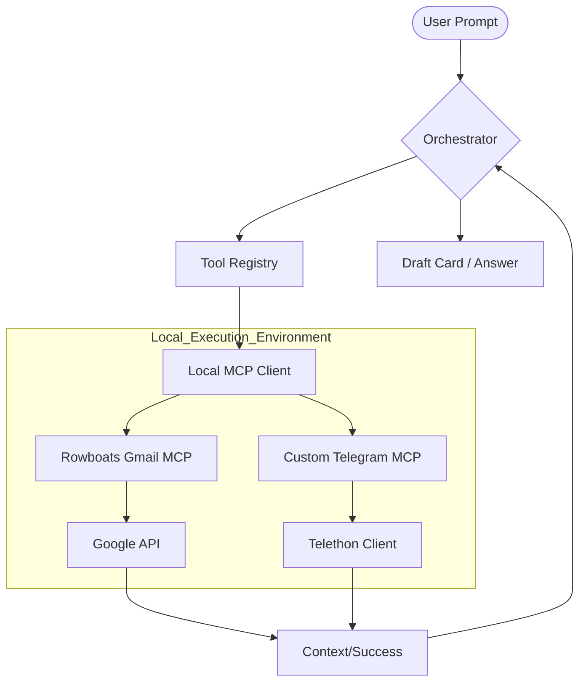

# Specification: Personal Platform Integration (Personal Assistant Mode)

## 1. Executive Summary
This document specifies the "Personal Assistant" layer for the chatbot. The goal is to safely bridge the AI with the user's private communication channels (Gmail, Telegram, LinkedIn, WhatsApp, etc.) to enable context-aware question answering and proxy actions (drafting/sending).

## 2. Strategic Rollout Phases
To manage complexity and testing, we will follow a phased approach:
* **Phase 1 (Priority):** Gmail, Telegram, LinkedIn.
* **Phase 2:** WhatsApp, Line, Slack.
* **Phase 3:** Integration of cross-platform "Calendar" & "Contacts" tools.

---

## 3. Architecture: The "Local-First Hybrid" Model

### 3.1 Local Execution & Privacy
All platform-specific interactions will occur **locally** via the Model Context Protocol (MCP).
* **No Cloud Auth:** Credentials (OAuth tokens, Session files, API keys) are stored on the user's Mac in a secured hidden directory (e.g., `~/.chatbot-ai/integrations/`).
* **MCP Topology:** The chatbot orchestrator (backend) connects to local MCP servers. These servers act as isolated bridges to the specific platforms.

### 3.2 Hybrid Engine Strategy
We will not "reinvent the wheel" for common platforms:
1. **Rowboatlabs MCP Servers:** Use these for standard APIs like **Gmail** and **Slack**. We will audit their code to ensure privacy compliance.
2. **Custom "Puppet" MCP Servers:** For platforms without official personal APIs or those requiring scraping (Telegram, LinkedIn, WhatsApp), we will build custom Python MCP servers using:
    *   **Telegram:** `Telethon` (MTProto implementation).
    *   **LinkedIn:** `Playwright` (Headless browser automation).
    *   **WhatsApp:** `Baileys` (TypeScript) or similar Python prototypes.

---

## 4. Feature Set & Functional Requirements

### 4.1 Reactive Context Retrieval
The chatbot will NOT pre-index all messages. Instead, it uses **On-Demand Reading**:
*   **Filters:** Tools must support `days_ago` and `message_limit` (defaulting to last 3 days or 50 messages).
*   **Semantic Search:** For platforms like Gmail, tools will wrap the native search API (e.g., `q="from:John status:unread"`).

### 4.2 Human-In-The-Loop (HITL) Actions
To avoid hallucinated replies or accidental spam, we enforce a strict **Draft-First** policy.
*   **Gmail:** Bot calls `draft_email`. The user is notified the draft is ready in their Gmail "Drafts" folder.
*   **Chat Platforms:** Bot presents a **Draft Card** in the UI. The message is NOT sent until the user clicks an explicit "Send Now" button in the chatbot interface.

### 4.3 Identity & Contact Resolution
The `IdentityResolutionService` will map natural language names to platform IDs:
*   **Tool:** `SearchContactsTool(query="David", platform="all")`.
*   **Logic:** LLM searches across connected platforms to find the best match (e.g., mapping "David" to a Telegram ID and a Gmail address) before initiating an action.

---

## 5. UI & UX Specifications

### 5.1 Plugins Tab Integration
The "Personal Assistant" configuration will be integrated directly into the existing **Plugins Dashboard**.
*   **Access Pattern:** User navigates to the `Plugins` tab. Clicking on a specific platform plugin (e.g., Gmail) opens a detailed settings view.
*   **Multi-Tab detailed view:**
    *   **Tab 1: Overview** - Status and general info.
    *   **Tab 2: Connect** - Connection logic (QR scan, OAuth button).
    *   **Tab 3: Permissions** - Granular control over `Read`, `Draft`, and `Send` capabilities.
*   **Guardrails:** The chatbot orchestrator will check these permissions before attempting any tool call.

### 5.2 The "Draft Card" Component
When the bot proposes a message, it renders a custom React component in the chat thread:
*   **Header:** Platform Icon (e.g., Telegram Logo) + Recipient Name.
*   **Body:** Editable text area containing the proposed message.
*   **Actions:** `[ Edit ]` `[ Re-Generate ]` `[ Send Now ]` `[ Cancel ]`.

---

## 6. Technical Components Breakdown

### 6.1 Tool Interfaces (Proposed)

| Tool Name | Parameters | Description |
| :--- | :--- | :--- |
| `gmail_search` | `query`, `limit` | Searches Gmail using native operators. |
| `gmail_draft` | `to`, `subject`, `body` | Creates a draft in the user's Gmail account. |
| `telegram_read` | `chat_name`, `limit` | Fetches last N messages from a specific chat/group. |
| `telegram_send` | `recipient_id`, `text` | Sends a message via the user's personal Telegram account. |
| `linkedin_inbox` | `unread_only` | Extracts recent messages from the LinkedIn messaging portal. |

### 6.2 Data Flow Diagram (Draft)

---

## 7. Deployment & Safety

### 7.1 Feature Flags
To ensure zero regressions in the production chatbot, all Personal Assistant features will be gated behind **Feature Flags**:
*   `ENABLE_PERSONAL_GMAIL`: Controls visibility of Gmail tools and UI.
*   `ENABLE_PERSONAL_TELEGRAM`: Controls visibility of Telegram tools and UI.
*   **Default State:** All flags are `OFF` in the main branch until stable.

### 7.2 Safety & Maintenance
*   **Rate Limiting:** All "Puppet" tools will include randomized delays (2-5 seconds) to mimic human behavior and avoid platform bans.
*   **Session Refresh:** The system must detect when an MCP session expires (e.g., Telegram logout) and prompt the user via the UI to re-authenticate (e.g., "Scan QR Code for Telegram").
*   **Context Truncation:** Automatic stripping of HTML, headers, and signatures before passing data to the LLM to save tokens and improve reasoning quality.
